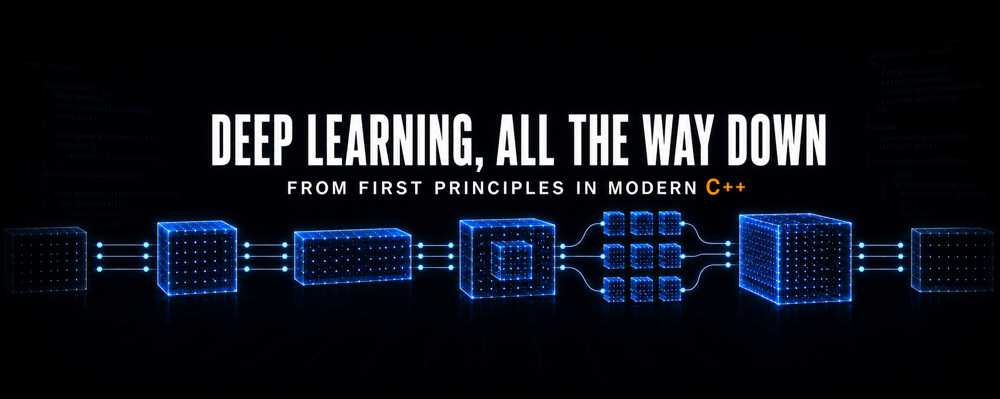

<p align="center">
  
</p>

# Deep Learning, All the Way Down

Build the foundations of deep learning from first principles in modern C++.

This code-first series starts with tensor storage and automatic differentiation,
then builds toward neural networks, performance engineering, GPU programming,
and custom CUDA kernels.

[Watch the complete series on YouTube](https://www.youtube.com/playlist?list=PLZSg76FHvdTw)

## Episodes

Each episode ends with a Git commit that preserves the code written on screen.
Use the commit links to inspect or run an earlier version.

| Episode | Topics | Code | Video |
| --- | --- | --- | --- |
| 1 | Tensor storage, shape, rank, invariants, and checked indexing | [`bedb564`](https://github.com/mechanical-turk/deep-learning-all-the-way-down/commit/bedb564) | [Watch](https://www.youtube.com/watch?v=DmU2b64tWfA) |
| 2 | Scalars, empty tensors, overflow checks, mutation, and `sum()` | [`b25de0c`](https://github.com/mechanical-turk/deep-learning-all-the-way-down/commit/b25de0c) | [Watch](https://www.youtube.com/watch?v=8kzL5NdxGCo) |
| 3 | Elementwise operations, dot product, and a linear prediction | [`c4d4509`](https://github.com/mechanical-turk/deep-learning-all-the-way-down/commit/c4d4509) | [Watch](https://www.youtube.com/watch?v=R_NZJ_rcX7E) |
| 4 | Rank-two matrix multiplication | [`022c750`](https://github.com/mechanical-turk/deep-learning-all-the-way-down/commit/022c750) | [Watch](https://www.youtube.com/watch?v=ZC6F284rRGo) |
| 5 | Tensor broadcasting with effective strides | [`79461fb`](https://github.com/mechanical-turk/deep-learning-all-the-way-down/commit/79461fb) | [Watch](https://www.youtube.com/watch?v=70mVVGNc0Ik) |
| 6 | Mean reduction, division, and mean squared error | [`92aa868`](https://github.com/mechanical-turk/deep-learning-all-the-way-down/commit/92aa868) | [Watch](https://www.youtube.com/watch?v=26Eg8tpM6_Q) |
| 7 | Scalar computation graphs and reverse-mode autograd | [`e692363`](https://github.com/mechanical-turk/deep-learning-all-the-way-down/commit/e692363) | [Watch](https://www.youtube.com/watch?v=QEZvHrZDSdw) |
| 8 | Tensor computation graphs and arithmetic autograd | [`7021cfe`](https://github.com/mechanical-turk/deep-learning-all-the-way-down/commit/7021cfe) | [Watch](https://www.youtube.com/watch?v=RXCeVnhjHCQ) |
| 9 | Sum and matrix multiplication backward, gradient descent, and linear regression | [`656f826`](https://github.com/mechanical-turk/deep-learning-all-the-way-down/commit/656f826) | [Watch](https://www.youtube.com/watch?v=h3p_rkzDPys) |
| 10 | ReLU, sigmoid, tanh, and nonlinear regression | [`2846756`](https://github.com/mechanical-turk/deep-learning-all-the-way-down/commit/2846756092647df3e617021d3a468c07615317f4) | Video pending |
| 11 | Neural-network modules and a first multilayer perceptron *(Work in progress)* |  |  |

## Why build this

Deep learning frameworks make sophisticated systems easy to assemble, but their
abstractions can hide the machinery underneath. We rebuild these systems one
piece at a time:

- tensor shape, storage, and indexing;
- elementwise operations, reductions, and broadcasting;
- matrix multiplication and loss functions;
- computation graphs and reverse-mode automatic differentiation;
- training loops, neural network layers, and optimizers;
- CPU performance, GPU programming, and CUDA kernels.

This is an educational implementation, not a production framework or an
attempt to replace PyTorch. The goal is to understand the mathematics, data
structures, ownership decisions, and hardware behavior inside mature deep
learning frameworks.

## Build and run

The current programs are self-contained, use C++23, and depend only on the C++
standard library.

Using Clang:

```sh
clang++ -std=c++23 main.cpp -o main
./main

clang++ -std=c++23 scalar_autograd.cpp -o scalar_main
./scalar_main
```

Using GCC:

```sh
g++ -std=c++23 main.cpp -o main
./main

g++ -std=c++23 scalar_autograd.cpp -o scalar_main
./scalar_main
```

Both programs use assertions to verify their behavior. A successful run prints:

```text
Success!
```

## Explore an earlier episode

Check out any episode's commit to inspect or run the code written during that
episode:

```sh
git switch --detach bedb564
clang++ -std=c++23 main.cpp -o main
./main
```

Return to the latest checkpoint with:

```sh
git switch main
```

## Repository layout

```text
.
├── main.cpp             # cumulative Tensor implementation
├── scalar_autograd.cpp  # scalar reverse-mode autograd
├── .clang-format        # formatting rules used in the series
├── .clangd              # clangd configuration
└── .vscode              # editor settings used while recording
```

We keep the code compact while building the foundations. We will split
interfaces, implementations, tests, and benchmarks when that structure makes
the code easier to understand.

## Implementation status

[`main.cpp`](./main.cpp) contains the tensor implementation developed through
Episode 6. It supports:

- owned `double` storage with explicit shape metadata;
- rank-zero scalars and empty tensors;
- overflow-safe element counting and checked multidimensional indexing;
- mutable and const element access;
- `sum()` and `mean()` reductions;
- elementwise addition, subtraction, multiplication, and division;
- vector dot products;
- rank-two matrix multiplication;
- NumPy-style broadcasting through effective zero strides;
- mean squared error.

[`scalar_autograd.cpp`](./scalar_autograd.cpp) contains the scalar reverse-mode
automatic differentiation engine introduced in Episode 7. It supports:

- graph nodes that store values, operations, and parent relationships;
- `Value` handles that share graph nodes;
- arithmetic operators that construct computation graphs;
- topological traversal of shared graphs;
- reverse-order gradient propagation;
- local derivative rules and gradient accumulation;
- a complete backward pass from scalar loss to weights and bias.

Scalar autograd remains separate from `Tensor`. The next step will connect the
two.

## Episode summaries

### Episode 1: Build a tensor from scratch in C++

The series begins with a small `Tensor` class in one C++23 file. We store values
in a flat, row-major `std::vector<double>` while shape metadata describes the
tensor's dimensions. The implementation establishes rank, element count,
constructor invariants, and checked multidimensional indexing. It also shows
how strides map tensor coordinates to flat storage without relying on a machine
learning library.

[Code checkpoint](https://github.com/mechanical-turk/deep-learning-all-the-way-down/commit/bedb564)
· [Watch on YouTube](https://www.youtube.com/watch?v=DmU2b64tWfA)

### Episode 2: Add tensor scalars, mutation, and reductions

The tensor model expands to cover rank-zero scalars, singleton vectors, and
empty tensors. We make shape multiplication safe from integer overflow, add
const and mutable element access, and preserve the relationship between shape
and storage. The first tensor reduction, `sum()`, turns any tensor into a scalar
and defines the sum of an empty tensor as zero.

[Code checkpoint](https://github.com/mechanical-turk/deep-learning-all-the-way-down/commit/b25de0c)
· [Watch on YouTube](https://www.youtube.com/watch?v=8kzL5NdxGCo)

### Episode 3: Implement C++ tensor operations and dot products

Two tensors can now take part in the same calculation. We implement equal-shape
elementwise addition, subtraction, and multiplication without changing either
input. A dot product combines multiplication with a sum reduction, which lets
the tensor express a complete linear prediction with weights, features, and a
scalar bias.

[Code checkpoint](https://github.com/mechanical-turk/deep-learning-all-the-way-down/commit/c4d4509)
· [Watch on YouTube](https://www.youtube.com/watch?v=R_NZJ_rcX7E)

### Episode 4: Build matrix multiplication in C++

Matrix multiplication extends linear prediction from one observation to a
batch of observations. The implementation validates rank and inner dimensions,
then computes every output value as the dot product of one row and one column.
The code makes the three-loop matrix multiplication algorithm and its row-major
index calculations explicit.

[Code checkpoint](https://github.com/mechanical-turk/deep-learning-all-the-way-down/commit/022c750)
· [Watch on YouTube](https://www.youtube.com/watch?v=ZC6F284rRGo)

### Episode 5: Implement tensor broadcasting in C++

Elementwise operations no longer require identical shapes. We define
NumPy-style broadcasting by aligning dimensions from the right and accepting
dimensions that match or have size one. Effective zero strides reuse a
broadcast value across an output dimension without allocating an expanded copy
of the input tensor.

[Code checkpoint](https://github.com/mechanical-turk/deep-learning-all-the-way-down/commit/79461fb)
· [Watch on YouTube](https://www.youtube.com/watch?v=70mVVGNc0Ik)

### Episode 6: Build mean squared error from scratch

Division and `mean()` complete the operations needed for a basic regression
loss. We compare predictions with targets, square each residual, and average the
results to implement mean squared error in C++. The example also explains why
raw residuals can cancel each other even when every prediction is wrong.

[Code checkpoint](https://github.com/mechanical-turk/deep-learning-all-the-way-down/commit/92aa868)
· [Watch on YouTube](https://www.youtube.com/watch?v=26Eg8tpM6_Q)

### Episode 7: Build reverse-mode automatic differentiation in C++

A separate scalar engine introduces computation graphs and reverse-mode
automatic differentiation before those ideas reach the tensor class. `Value`
objects share graph nodes that remember the operation and inputs behind each
result. A topological traversal orders the graph, while the backward pass uses
the chain rule and gradient accumulation to propagate a scalar loss back to
weights and bias.

[Code checkpoint](https://github.com/mechanical-turk/deep-learning-all-the-way-down/commit/e692363)
· [Watch on YouTube](https://www.youtube.com/watch?v=QEZvHrZDSdw)

### Episode 8: Add tensor autograd in C++

The tensor now records whole operations in a computation graph. Shared nodes
keep tensor values and gradients alive, while reverse topological traversal
sends gradients back through addition, subtraction, multiplication, and
division. The backward helper reuses broadcast strides to accumulate
contributions into each input. Reduction and matrix multiplication backward
remain for the next episode.

[Code checkpoint](https://github.com/mechanical-turk/deep-learning-all-the-way-down/commit/7021cfe)
· [Watch on YouTube](https://www.youtube.com/watch?v=RXCeVnhjHCQ)

### Episode 9: Train linear regression in C++

The tensor can now train a linear regression model from end to end. We build
the batched forward pass, add backward rules for matrix multiplication and
sum, and update the weight and bias with gradient descent. Parameter gradients
reset between training steps while the backward pass clears temporary graph
gradients. Starting from zero, the model learns a weight of 2 and a bias of 1
from ten points on the line y = 2x + 1.

[Code checkpoint](https://github.com/mechanical-turk/deep-learning-all-the-way-down/commit/656f826)
· [Watch on YouTube](https://www.youtube.com/watch?v=h3p_rkzDPys)

### Episode 10: Build activation functions in C++

We add ReLU, sigmoid, and tanh to the Tensor, with forward and backward rules
for each activation. Shared unary helpers apply the functions element by
element and propagate gradients through the computation graph. We compare
the activations on the same inputs, then train a nonlinear regression model
on nine points from y = tanh(2x + 1). Starting from zero, gradient descent
recovers a weight of 2 and a bias of 1.

[Code checkpoint](https://github.com/mechanical-turk/deep-learning-all-the-way-down/commit/2846756092647df3e617021d3a468c07615317f4)
· Video pending

## Direction

The next stages will connect automatic differentiation to tensors and use it to
train small models. From there, the project will build toward neural network
layers, optimizers, attention, transformers, systems profiling, GPU execution,
and custom CUDA kernels.

We will redesign the implementation when a new capability exposes a weakness
in the current representation. Those redesigns are part of the material.

## Feedback

Technical feedback is welcome, especially around correctness, C++ API design,
ownership, numerical behavior, and performance. Open a GitHub issue with a
small example when possible.
